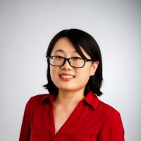
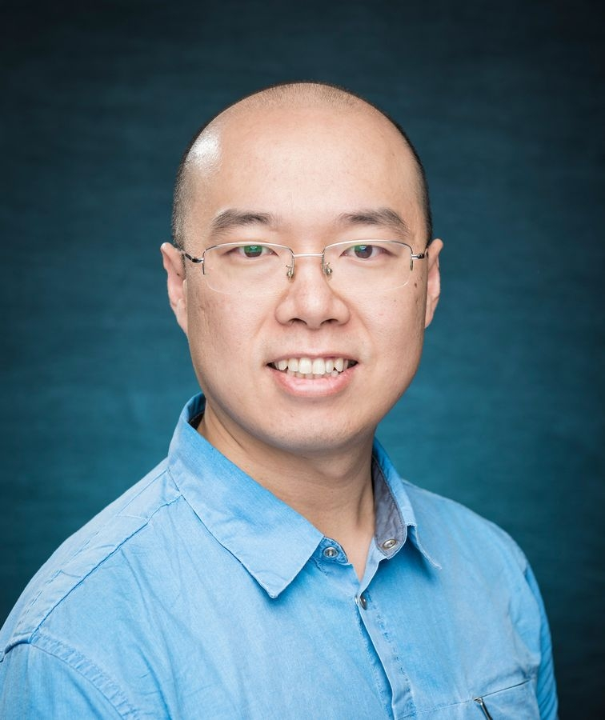
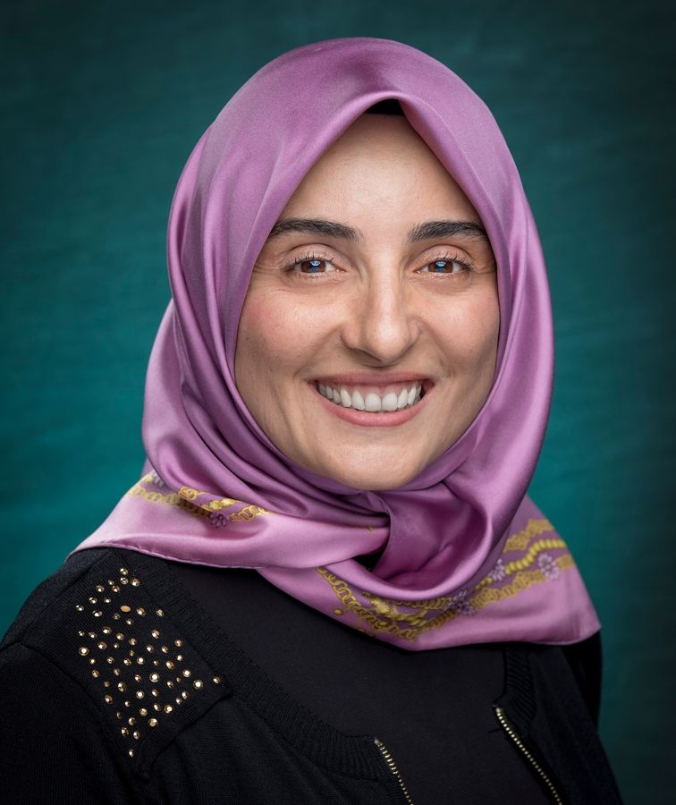
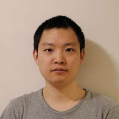
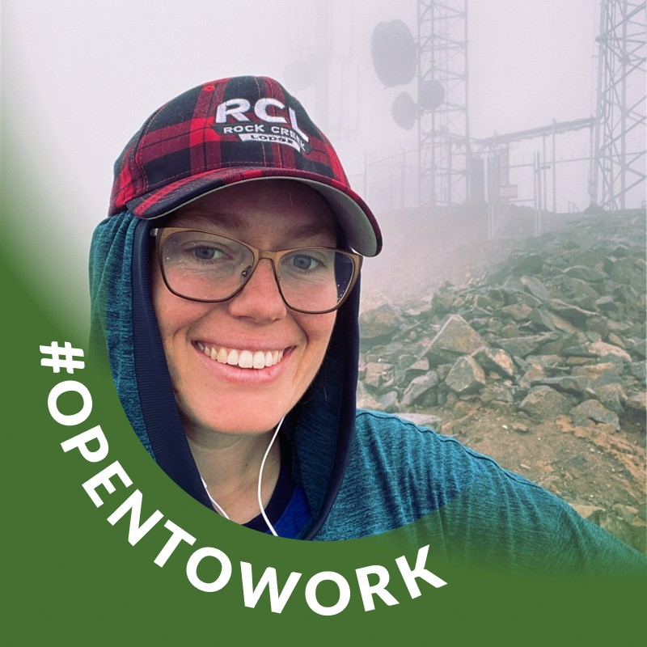

# Organizers

[Dr. Qianqian Liu](https://uncw.edu/profiles/l/liuq/) is an Associate Professor in the Department of Physics and Physical Oceanography, as well as the Center for Marine Science, at the University of North Carolina Wilmington. She graduated from the University of Rhode Island with a PhD degree in Physical Oceanography in 2015. Before joining the academic community in North Carolina, Dr. Liu refined her skills as a postdoctoral fellow at the NOAA Great Lakes Environmental Research Laboratory, which is affiliated with the University of Michigan and Grand Valley State University. Her research is focused on coastal and estuarine hydrodynamics and biophysical processes (particularly how the physical processes influence biological processes) using numerical and machine learning modeling.

 

[Dr. Yang Song](https://uncw.edu/profiles/s/songy/) is an Associate Professor at the **Computer Science Department, UNCW**. His work mainly revolves around data science, data mining, and deep learning, but what really excites me is finding ways to apply machine learning and data mining to oceanography. His research goal is to improve forecasting methods and, along the way, tackle the unique machine learning challenges that come up in human learning and social science.  

[Dr. Gulustan Dogan](https://uncw.edu/profiles/d/dogang) is an associate professor at University of North Carolina Wilmington in Computer Science department. She worked at Yildiz Technical University as an Associate Professor. She worked at NetApp and Intel as a software engineer in Silicon Valley. She is one of the founding members of Turkish Women in Computing (TWIC), a Systers community affiliated with Anita Borg Institute. She also serves as Wilmington Ambassador of Women In Data Science Stanford.

[Dr. Zhengui Wang](https://www.vims.edu/ccrm/about/staff/wang_z.php) is an Associate Research Scientist at the **Center for Coastal Resource Management, VIMS**. His research expertise is Numerical/Hydrodynamic Modeling. He received his Ph.D. in Physical Oceanography from the Virginia Institute of Marine Science, William and Mary, in 2017

[Mina Gachloo](https://www.linkedin.com/in/mina-gachloo/) was a master's student who worked with Dr. Yang Song from 2023 to 2024. Then she continued working on her Ph.D. degree at Clemson University.

[Katherine Boot](https://www.linkedin.com/in/katherine-boot-231963116/) is a PhD student at University of North Carolina Wilmington. Her advisor is Dr. Qianqian Liu, and her dissertation title is "Assessing the influence of sea-level rise induced salt intrusion and associated circulation change on southern flounder (Paralichthys lethostigma) recruitment processes in Albemarle-Pamlico Sound."

